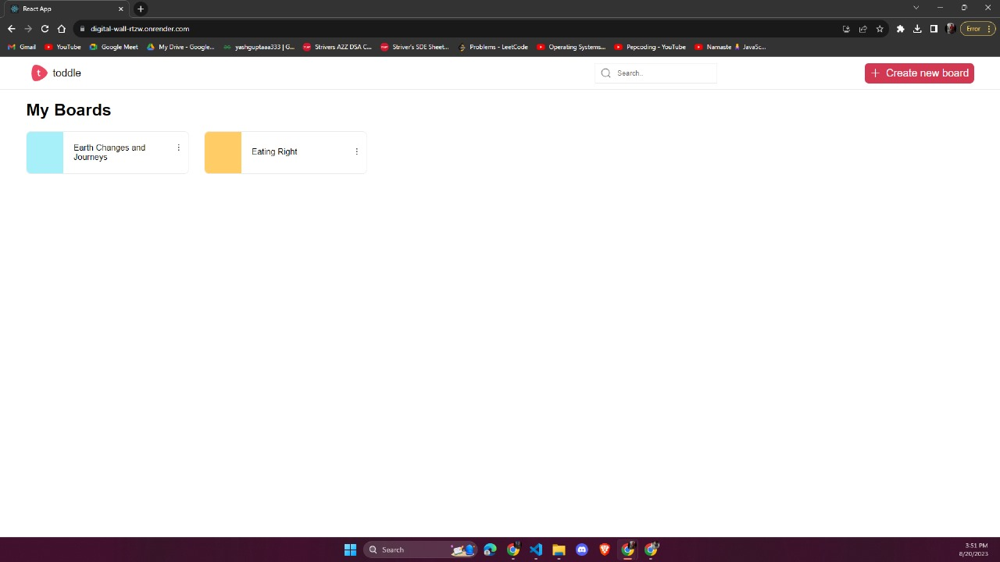
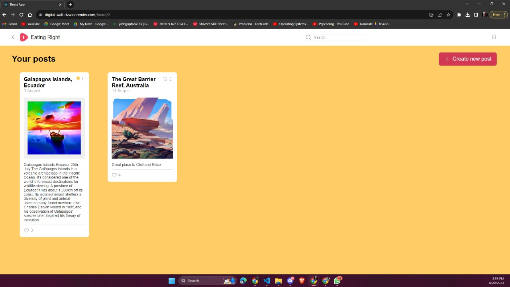

# Digital Wall

Toddle Assignment 
## Introduction
The Digital Wall project is a web application built using React that allows users to create, update and delete boards. On the board, users can create, update, and delete and like posts.

## Features
- Users can create, update and delete posts.
- In each board, users can create, update and delete posts.
- Users are able to like posts.
- Users can search boards by title in the wall.
- Users can search posts by title on the particular board.
- Users can rearrange posts by drag and drop inside the board.
- Users can be able to bookmark posts.

## How to use
`npm install`
 
`npm start`

## Dependencies
- React framework
- Redux for state management
- react-beautiful-dnd for Drag and Drop Feature
- react-router-dom for routing 

## Screenshots

## Deployment
- Link : https://digital-wall-rtzw.onrender.com
- Deployed on Render

